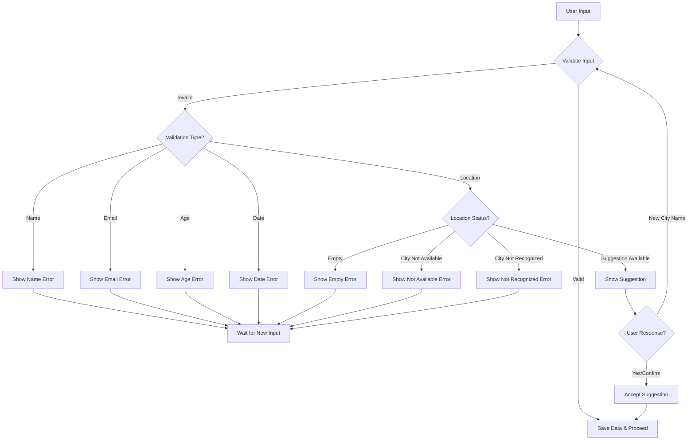

# מערכת הולידציה - הסברים ודוגמאות

מסמך זה מסביר את סוגי הולידציות השונים הקיימים במערכת ואת הודעות השגיאה האפשריות עבור כל סוג ולידציה.

## סיכום השינויים

1. **ארגון מחדש של מערכת הולידציה**:
   - איחוד `ValidatorRegistry` ו-`ValidationHandler` לקובץ אחד: `validators/index.js`
   - פישוט תהליך הולידציה והפחתת הקוד הכפול
   - שיפור הביצועים על ידי הפחתת שכבות התוכנה

2. **שיפור הודעות השגיאה**:
   - הוספת הסברים מפורטים יותר לכל סוג שגיאה
   - הוספת דוגמאות לעזרה למשתמש
   - הוספת הנחיות חזרה לתפריט הראשי

3. **שיפור תהליך הצעות למיקום**:
   - תמיכה בהצעות חלופיות לערים
   - אפשרות לאישור הצעה באמצעות תשובה חיובית פשוטה ("כן", "אכן" וכו')
   - שיפור חווית המשתמש בתהליך הזיהוי של ערים

4. **שיפור בתהליך הולידציה**:
   - הבוט ממתין לקלט תקין מהמשתמש
   - הבוט מציג הודעות שגיאה ברורות ומפורטות
   - אפשרות לחזרה לתפריט הראשי בכל שלב

## ולידציית שם (Name Validator)

### הודעות שגיאה:

| קוד שגיאה | הסבר | דוגמה |
|-----------|------|-------|
| **empty** | מוצג כאשר המשתמש לא הזין כלום | המשתמש שלח הודעה ריקה |
| **tooShort** | מוצג כאשר השם קצר מדי (פחות מ-4 תווים לשם מלא או פחות מ-2 תווים לשם פרטי) | "אבי" - קצר מדי לשם מלא |
| **tooLong** | מוצג כאשר השם ארוך מדי (יותר מ-50 תווים) | שם שמכיל יותר מדי תווים |
| **notEnoughWords** | מוצג כאשר אין מספיק מילים בשם (לפחות 2 מילים נדרשות לשם מלא) | "ישראל" - חסר שם משפחה |
| **tooManyWords** | מוצג כאשר יש יותר מדי מילים בשם (יותר מ-4 מילים) | "ישראל משה דוד כהן לוי" - יותר מדי מילים |
| **invalidCharacters** | מוצג כאשר השם מכיל תווים לא חוקיים (מספרים או תווים מיוחדים) | "ישראל123" או "ישראל!" |
| **duplicateWords** | מוצג כאשר יש מילים שחוזרות על עצמן בשם | "ישראל ישראל" |
| **cityName** | מוצג כאשר הקלט נראה כמו שם של עיר במקום שם אדם | "תל אביב" |

## ולידציית אימייל (Email Validator)

### הודעות שגיאה:

| קוד שגיאה | הסבר | דוגמה |
|-----------|------|-------|
| **empty** | מוצג כאשר המשתמש לא הזין כלום | המשתמש שלח הודעה ריקה |
| **invalid** | מוצג כאשר כתובת האימייל אינה תקינה | "test@", "test", "test@example" (חסר סיומת) |

## ולידציית גיל (Age Validator)

### הודעות שגיאה:

| קוד שגיאה | הסבר | דוגמה |
|-----------|------|-------|
| **empty** | מוצג כאשר המשתמש לא הזין כלום | המשתמש שלח הודעה ריקה |
| **notNumber** | מוצג כאשר הקלט אינו מספר | "עשרים", "abc" |
| **tooYoung** | מוצג כאשר הגיל נמוך מהמינימום המוגדר (ברירת מחדל: 16) | "15" כאשר המינימום הוא 16 |
| **tooOld** | מוצג כאשר הגיל גבוה מהמקסימום המוגדר (ברירת מחדל: 120) | "121" |
| **invalidRange** | מוצג כאשר הגיל אינו בטווח המותר | מוצג במקרים מיוחדים כאשר מוגדר טווח ספציפי |

## ולידציית תאריך (Date Validator)

### הודעות שגיאה:

| קוד שגיאה | הסבר | דוגמה |
|-----------|------|-------|
| **empty** | מוצג כאשר המשתמש לא הזין כלום | המשתמש שלח הודעה ריקה |
| **invalid** | מוצג כאשר הפורמט של התאריך אינו תקין | "30/13/2023" (חודש לא תקין), "abc" |
| **futureOnly** | מוצג כאשר נדרש תאריך עתידי אך הוזן תאריך בעבר | "01/01/2000" כאשר מוגדר futureOnly=true |
| **pastOnly** | מוצג כאשר נדרש תאריך בעבר אך הוזן תאריך עתידי | "01/01/2030" כאשר מוגדר pastOnly=true |
| **tooEarly** | מוצג כאשר התאריך מוקדם מהתאריך המינימלי המוגדר | "01/01/2020" כאשר minDate="01/01/2022" |
| **tooLate** | מוצג כאשר התאריך מאוחר מהתאריך המקסימלי המוגדר | "01/01/2025" כאשר maxDate="01/01/2024" |

## ולידציית מיקום (Location Validator)

### הודעות שגיאה:

| קוד שגיאה | הסבר | דוגמה |
|-----------|------|-------|
| **קלט_ריק** | מוצג כאשר המשתמש לא הזין כלום | המשתמש שלח הודעה ריקה |
| **עיר_לא_זמינה** | מוצג כאשר העיר שהוזנה אינה נתמכת במערכת | "אילת" אם אילת אינה בין הערים הנתמכות |
| **הצעה_עיר_לא_זמינה** | מוצג כאשר המערכת מזהה עיר דומה, אך גם היא אינה נתמכת | המשתמש הקליד "תא" והמערכת זיהתה "תל אביב", אך תל אביב אינה נתמכת |
| **עיר_לא_מוכרת** | מוצג כאשר המערכת לא מזהה את הקלט כעיר | "אבגדה" - לא מזוהה כעיר |
| **SUGGESTION_SERVICEABLE** | מוצג כאשר המערכת מציעה עיר דומה שכן נתמכת | המשתמש הקליד "תא" והמערכת מציעה "תל אביב" |

## התנהגות הבוט בעת שגיאות ולידציה

כאשר המשתמש מזין קלט שאינו עובר את הולידציה, הבוט:

1. **שומר את המשתמש באותו צעד** - הבוט לא מתקדם לצעד הבא
2. **מציג הודעת שגיאה מותאמת** - בהתאם לסוג השגיאה שהתרחשה
3. **ממתין לקלט חדש מהמשתמש** - הבוט מחכה שהמשתמש יזין קלט תקין

המשתמש יישאר בלולאה של אותו צעד עד שיזין קלט שעובר את הולידציה בהצלחה, או עד שישלח פקודת מערכת כמו "תפריט" (אם מוגדר).

### דוגמה לתהליך ולידציה:

1. הבוט שואל: "מה שמך המלא?"
2. המשתמש עונה: "דן"
3. הבוט מזהה שגיאת `notEnoughWords` ומשיב: "אנא הכנס שם מלא (שם פרטי ושם משפחה לפחות)"
4. המשתמש נשאר באותו צעד וצריך לנסות שוב
5. המשתמש עונה: "דן כהן"
6. הקלט תקין, הבוט שומר את השם ועובר לצעד הבא

## התאמה אישית של הודעות שגיאה

ניתן להתאים אישית את הודעות השגיאה עבור כל סוג ולידציה באמצעות הגדרת `errorMessages` בתסריט:

```json
"validation": {
  "type": "Name",
  "errorMessages": {
    "empty": "נא להזין שם",
    "notEnoughWords": "יש להזין שם פרטי ושם משפחה",
    "tooShort": "השם שהזנת קצר מדי"
  }
}
```

## הוספת הנחיות חזרה

ניתן להוסיף הנחיות חזרה לתפריט הראשי בהודעות השגיאה של ולידציית מיקום:

```json
"cityValidationConfig": {
  "messages": {
    "הוראת_חזרה": "לחזרה לתפריט הראשי, שלח את המילה \"תפריט\""
  }
}
```

## תהליך הצעות למיקום

כאשר המשתמש מקליד שם עיר חלקי או שגוי, המערכת יכולה להציע עיר דומה:

1. המשתמש מקליד: "תא"
2. המערכת מזהה: "תל אביב" כאפשרות קרובה
3. הבוט שואל: "האם התכוונת ל*תל אביב*? השב כן לאישור או הקלד את שם העיר הנכון."
4. אם המשתמש עונה "כן", "אכן", "נכון" וכו' - המערכת מקבלת את ההצעה ועוברת לשלב הבא
5. אם המשתמש מקליד שם עיר אחר, המערכת תבדוק את העיר החדשה

### הגדרת אפשרויות אישור להצעות:

```json
"options": {
  "כן || אכן || נכון || בדיוק || כן בהחלט": "confirm_suggestion"
},
"branches": {
  "confirm_suggestion": "next_step"
}
```

## דיאגרמת זרימה של תהליך הולידציה

